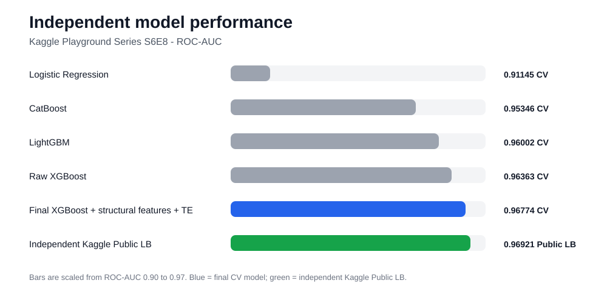

# Predicting Smartphone Addiction

[](https://github.com/miladakbariv/smartphone-addiction-kaggle/actions/workflows/tests.yml)

An end-to-end machine learning project for the **Kaggle Playground Series S6E8** binary classification task, focused on robust validation, leakage-safe feature engineering, reusable code, and transparent experiment tracking.

## Highlights

- Built an end-to-end binary classification pipeline on **691k+ training samples**
- Improved mean CV ROC-AUC from **0.91145 to 0.96774**
- Achieved **0.96921 Kaggle Public LB ROC-AUC** with an independently developed solution
- Implemented **leakage-safe nested cross-fitted exact-value target encoding**
- Designed structural screen-time features and validated them with **ablation studies**
- Compared Logistic Regression, LightGBM, CatBoost, and XGBoost under the same validation scheme
- Extracted the strongest transformations into reusable `src/` modules with data-free unit tests and CI

## Results Snapshot



## Results

| Experiment | ROC-AUC |
|---|---:|
| Logistic Regression | 0.91145 CV |
| CatBoost | 0.95346 CV |
| LightGBM | 0.96002 CV |
| Raw XGBoost | 0.96363 CV |
| XGBoost + cross-fitted target encoding | 0.96690 CV |
| **Final XGBoost + structural features + cross-fitted TE** | **0.96774 CV** |
| **Kaggle Public Leaderboard — independent model** | **0.96921** |

The leaderboard result reported here comes from the independently developed pipeline in this repository and does **not** rely on external prediction files.

## Problem

Predict whether a smartphone user belongs to the addicted class from behavioral and demographic features including daily and weekend screen time, social-media and gaming usage, work/study time, sleep, notifications, app opens, gender, stress level, and academic/work impact.

**Target:** `addicted_label`  
**Evaluation metric:** ROC-AUC

## Dataset

Training data:

- **691,369 rows**
- **12 predictive features**
- binary target with approximately **70.9% positive class**

Test data:

- **296,302 rows**

The dataset contains substantial missingness across several behavioral variables, with some differences in missing-value rates between train and test.

Competition data is intentionally excluded from Git. See [`data/README.md`](data/README.md) for setup instructions.

## Notebooks

The experiment story is split into three portfolio notebooks:

- [Exploratory Data Analysis](notebooks/01_eda_portfolio.ipynb)
- [Baseline Models](notebooks/02_baseline_portfolio.ipynb)
- [Advanced XGBoost](notebooks/03_xgboost_advanced_portfolio.ipynb)

## Project Workflow

### 1. Exploratory Data Analysis

The EDA investigates:

- dataset schema and target distribution
- missing-value patterns
- train/test missingness differences
- whether missingness itself carries target signal
- univariate numerical ROC-AUC
- categorical target-rate differences
- feature correlations
- nonlinear relationships between screen time and addiction probability

A key finding was the strongly nonlinear relationship between daily screen time and the target, motivating gradient-boosted tree models.

### 2. Baseline Models

All main model families were compared using the same **5-fold stratified cross-validation** design.

| Model | Mean CV ROC-AUC |
|---|---:|
| Logistic Regression | 0.911449 |
| CatBoost | 0.953460 |
| LightGBM | 0.960023 |
| XGBoost baseline | 0.963626 |

The gap between Logistic Regression and the boosted-tree models confirmed that nonlinear interactions are important in this dataset.

### 3. Leakage-Safe Target Encoding

Repeated exact numerical values contained useful predictive signal, but an early row-dependent encoding created a train/validation representation mismatch and was rejected.

The final approach uses **nested cross-fitted exact-value target encoding**:

- inner folds create out-of-fold encodings for each outer-training fold
- each training row is encoded from other rows only
- outer validation rows are encoded from the corresponding outer-training data only
- smoothing shrinks rare exact values toward the relevant training-fold target mean

This improved mean CV ROC-AUC from approximately:

`0.96363 -> 0.96690`

The reusable implementation lives in [`src/target_encoding.py`](src/target_encoding.py).

### 4. Structural Feature Engineering

The strongest engineered features model consistency between total screen time and its component activities:

- `screen_components_observed`
- `observed_component_sum`
- `screen_budget_slack`
- `other_screen_complete`

An ablation study showed that `screen_budget_slack` and `other_screen_complete` provided most of the gain.

The reusable implementation lives in [`src/features.py`](src/features.py).

### 5. Final Independent Model

The final model combines:

- XGBoost with native categorical handling
- nested cross-fitted exact-value target encoding
- structural screen-time features
- 5-fold out-of-fold validation
- fold-averaged test predictions

## Reusable Code

The portfolio notebooks remain the experiment record, while the strongest reusable transformations are exposed through `src/`:

```python
from src import add_crossfit_exact_te, add_structural_features
```

- `src/features.py` — structural screen-time feature engineering
- `src/target_encoding.py` — leakage-safe nested cross-fitted exact-value target encoding
- `src/__init__.py` — minimal public API for the two transformations
- `tests/` — lightweight unit tests that do not require Kaggle data or a GPU

## Quick Start

Clone the repository, create an environment, and install dependencies:

```bash
python -m venv .venv
python -m pip install -r requirements.txt
```

Activate the virtual environment using the command appropriate for your operating system, then run the test suite from the repository root:

```bash
python -m pytest
```

For the competition CSVs, follow [`data/README.md`](data/README.md).

## Testing and CI

The repository includes data-free unit tests for the reusable transformations. They verify structural-feature formulas, non-mutation of input frames, leakage-safe cross-fitting behavior, missing/unseen value handling, deterministic output for a fixed random seed, and the public `src` API.

GitHub Actions runs these lightweight tests automatically on pull requests and pushes to `main`.

CI intentionally does **not** download Kaggle data or retrain the full competition models. Its purpose is to verify the reusable transformation code quickly and independently of GPU access.

## Reproducibility Notes

The notebooks support both the Kaggle competition path and a local `../data/` directory.

The advanced XGBoost notebook was originally executed on Kaggle with GPU-enabled XGBoost (`device="cuda"`). On a CPU-only machine, set the XGBoost `device` parameter to `"cpu"` before re-running those cells. The recorded notebook outputs correspond to the original execution environment.

The reported CV and Public LB scores are the recorded results of the independently developed competition pipeline. This repository does not claim that the complete 691k-row competition training workflow has been re-executed on every supported local environment.

## What Did Not Help

Several experiments were evaluated and rejected:

- generic ratio/difference feature engineering
- stronger XGBoost regularization
- periodic sine/cosine transformations
- decimal-precision features
- early naive target encoding with representation mismatch
- computationally expensive RealMLP experiments

Keeping unsuccessful experiments helped separate reproducible improvements from changes that only increased complexity.

## Repository Structure

```text
smartphone-addiction-kaggle/
├── .github/
│   └── workflows/
│       └── tests.yml
├── assets/
│   └── model_results_v3.svg
├── data/
│   └── README.md
├── notebooks/
│   ├── 01_eda_portfolio.ipynb
│   ├── 02_baseline_portfolio.ipynb
│   └── 03_xgboost_advanced_portfolio.ipynb
├── src/
│   ├── __init__.py
│   ├── features.py
│   └── target_encoding.py
├── tests/
│   ├── test_features.py
│   ├── test_public_api.py
│   └── test_target_encoding.py
├── models/
├── submissions/
├── .gitignore
├── pytest.ini
├── README.md
└── requirements.txt
```

## Key Technical Lessons

This project demonstrates:

- stratified cross-validation
- ROC-AUC based model evaluation
- careful train/test distribution checks
- missing-value handling
- gradient boosting with LightGBM, CatBoost, and XGBoost
- leakage-safe target encoding
- nested cross-fitting
- feature ablation
- experiment comparison
- data-free unit testing for reusable ML transformations
- lightweight CI for portfolio reproducibility

The largest gain came not from increasing model complexity, but from improving the representation of the data while preserving strict validation integrity.

## Tech Stack

Python, pandas, NumPy, scikit-learn, LightGBM, CatBoost, XGBoost, Matplotlib, pytest, Jupyter Notebook, GitHub Actions

## Competition

Kaggle Playground Series S6E8: https://www.kaggle.com/competitions/playground-series-s6e8
